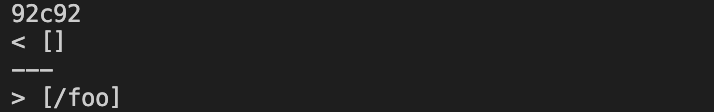
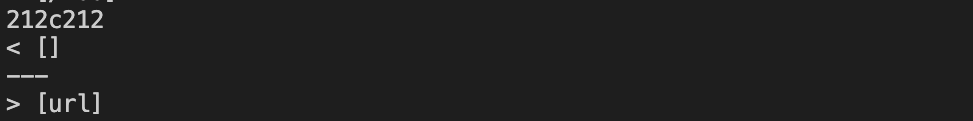

# Week 10 Lab Report
Q1:I use `diff` to figure out the difference between the results of running bash for loop by using the following command `diff mark-markdown-parse/results.txt mdparse/markdown-parse/result.txt`

## Test difference One
The first difference is on `14.md`. The result for provided implementation is `[/foo]`, but in my implementation is `[]`.As shown in the picture below.

1.According to CommonMarkDemo, the expected output should be `[]`. This means that my implementation is correct as the output is `[]`, and the given implementation is wrong as the output is `[/foo]` in this specific case.

Here is the test case for `14.md`

```
\*not emphasized*
\<br/> not a tag
\[not a link](/foo)
\`not code`
1\. not a list
\* not a list
\# not a heading
\[foo]: /url "not a reference"
\&ouml; not a character entity
```

2.The bug in the given implementation is that the code cannot identify if a `\` is in front of the line. 

In the following code block,which doesn't have a condition to identify this scenario,we can add the condition to identify  `\`. If we find it at the start, we can immediately return he program.

```
while(currentIndex < markdown.length()) {
    int nextOpenBracket = markdown.indexOf("[", currentIndex);
    int nextCodeBlock = markdown.indexOf("\n```");
    ...
}
```

## Test Difference Two
The second difference is on `194.md`. The result for provided implementation is `[url]`, but in my implementation is `[]`.As shown in the picture below.

1.According to CommonMarkDemo, the expected output should be `[]`. This means that my implementation is correct as the output is `[]`, and the given implementation is wrong as the output is `[url]` in this specific case.

Here is the test case for `194.md`
```
[Foo*bar\]]:my_(url) 'title (with parens)'
[Foo*bar\]]
```

2.The bug in the given implementation is that it cannot identify if there is content between closing brackets and openning parenthesis, which will make content invalid.

In the following code block, we don't have a contidion to check `nextCloseBracket`'s index in relative to `openParen`'s index. We can fix this by adding condition to check if the index is only 1 apart.

```
int nextCloseBracket = markdown.indexOf("]", nextOpenBracket);
int openParen = markdown.indexOf("(", nextCloseBracket);
```
