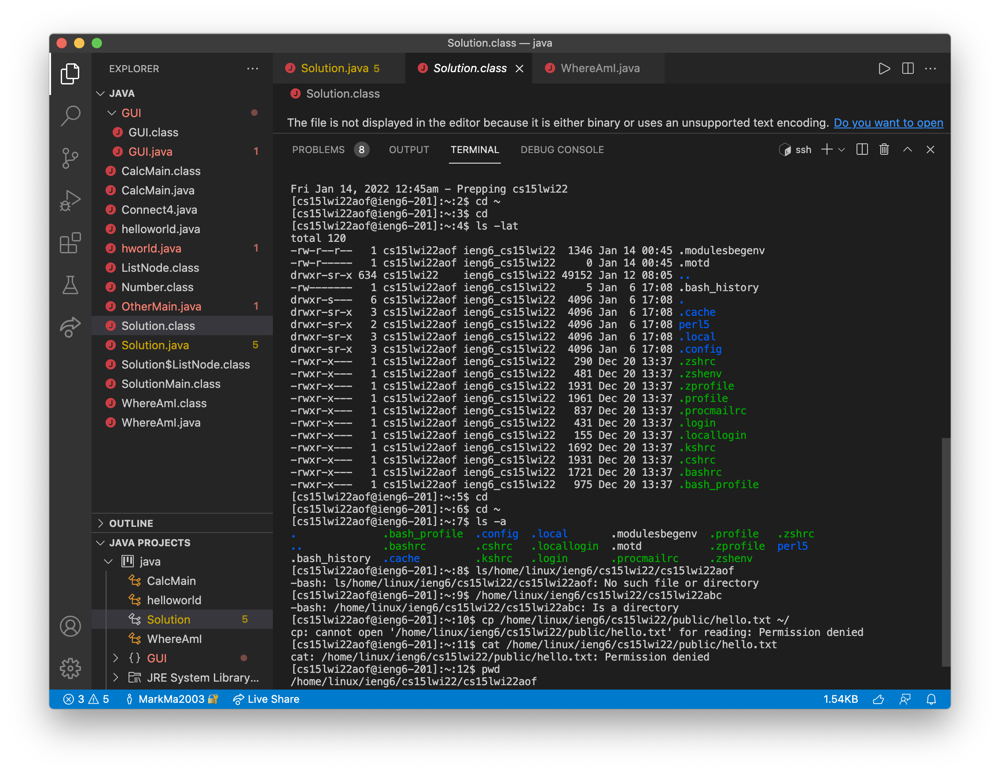

# Week 2 Lab Report

## Step 1: Installing VisualStudio Code

I've downloaded VSCode at [visual studio code website](https://code.visualstudio.com/), Then I can just open it and open a file.

---
## Step 2: Remote Connecting

We can log in the remote server by using `ssh` command after we changed the password for the account.

---
## Step 3: Trying Some Commands

I have tried some commands like `pwd`, `ls`,`cd` and so on on the server.

---

## Step 4: Moving Files

I moved the files using the `scp` command with the password.

---

## Step 5: Setting an SSH Key

I set the key with `ssh-keygen` command and store the key on my system.

---

## Step 6: Optimizing Remote Running

I can optimizing running by using scp to upload file and `ssh` to run without logging into the server. Before using `ssh cs15lwi22aoc@ieng6.ucsd.edu "javac WhereAmI.java java WhereAmI"` and SSH Keys, I need to type them seperately and log in. which is 80 keystrokes; Then the first time using above command is 67 keystrokes. At last, I can use up and enter to run the program, which is only 2 keystrokes.

