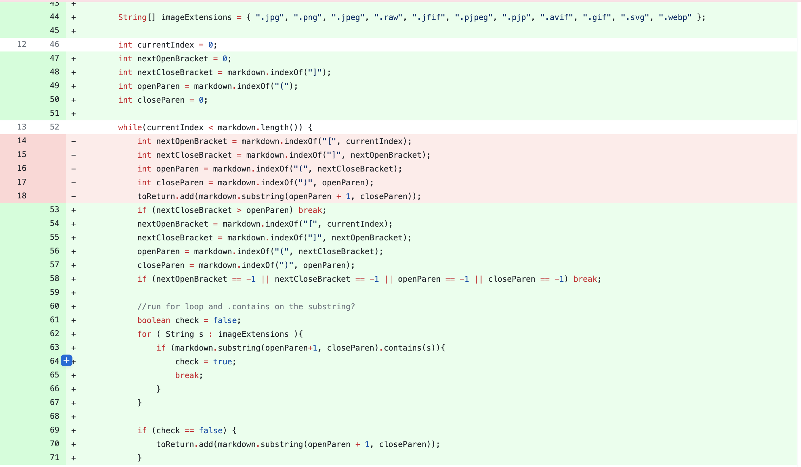
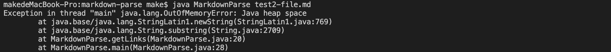
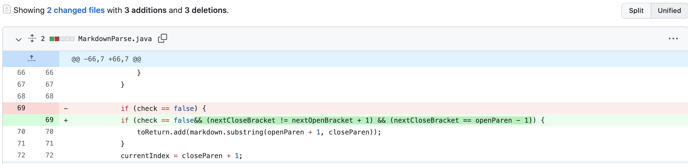
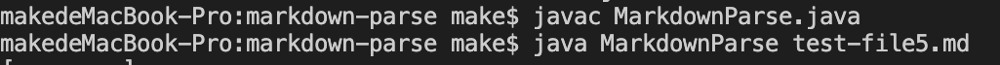
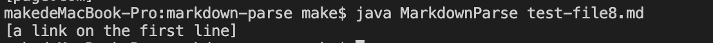

# Week 4 Lab Report

## First Code Changes

Here is the link to the failure induced input we designed:[link](https://markma2003.github.io/cse15l-lab-reports/testfiles/test2-file.md)

The symptom we observed when we run using `java MarkdownParse test2-file.md` is that we got the following run-time error, which means we got the infinte loop.

In the failure-induced test-file, we put the closing bracket at the very end. However, in the code, we will read the closing bracket second, which results in that there is no open parenthesis to be found after that. Then the program will go into an infinite loop, which is the symptom we observed. So, we update our code to read these brackets and parenthesis no matter the sequence of them.
## Second Code Changes

Here is the link to the failure induced input of test-file5:[link](https://markma2003.github.io/cse15l-lab-reports/testfiles/test-file5.md)

The symptom we observed when we run using `java MarkdownParse test-file5.md`, we got `[page.com]`, but the correct output should be `[]`. 

In the test-file5, the brackets and parenthesis are separated by content. The bug is that our code cannot check these scienario at this point. This resulted in the symptom that the program consider `page.com` as a valid link. As a result, we add `(nextCloseBracket == openParen - 1)` to check if the next open parenthesis is exactly after close bracket.
## Third Code Changes 

Here is the link to the failure induced input we designed:[link](https://markma2003.github.io/cse15l-lab-reports/testfiles/test-file8.md)

The symptom we observed when we run using `java MarkdownParse test8-file.md` we got `[a link on the first line]` instead of `[]`

In the test-file8, there is nothing inside the brackets and there is an invalid link inside the parentheses. The bug is that our code cannot check whether if there is something inside the brackets. As a result, we got `a link on the first line` as a link. Therefore, we add `nextCloseBracket != nextOpenBracket + 1` to our code in order to  consider this situation.