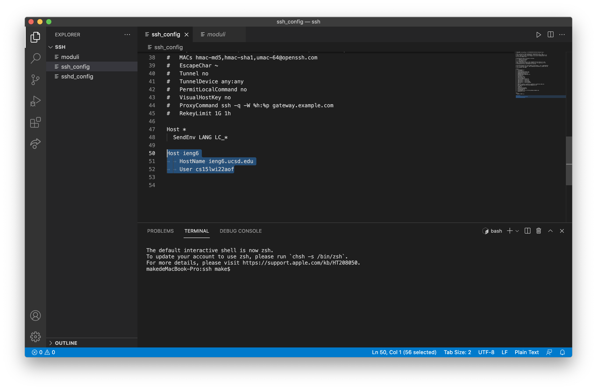
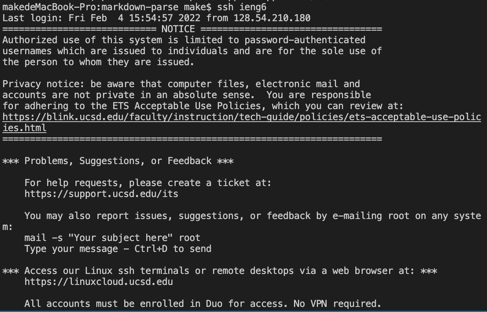

# Week 6 Lab Report

## Streamlining ssh Configuration

## Editing file

I opened `SSH` folder using the Visual Studio Code and edited `ssh_config` file by adding

`Host ieng6`

`HostName ieng6.ucsd.edu`

`User cs15lwi22aof`

## Logging in using alias

I logged into my account using the `ssh ieng6` command.

## Copying using alias

I copied `MarkdownParse.java` into the remote server using the command `scp MarkdownParse.java ieng6:~/`