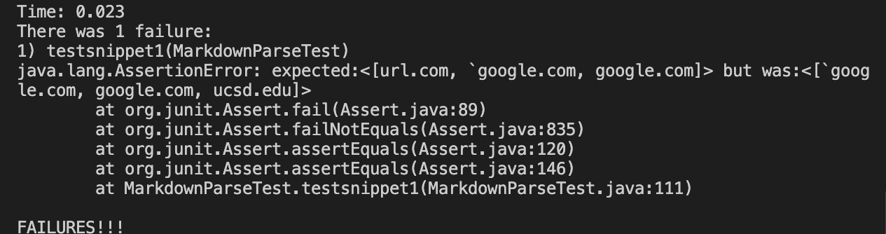
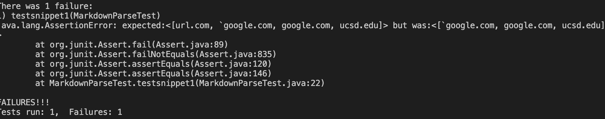
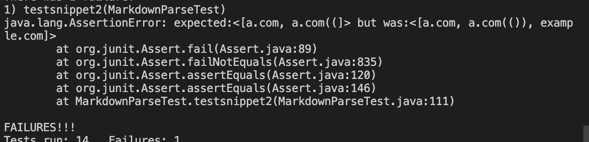
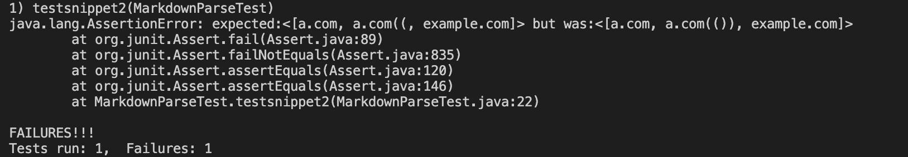
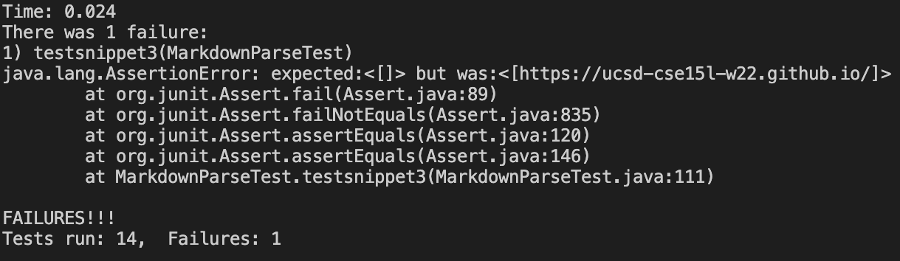
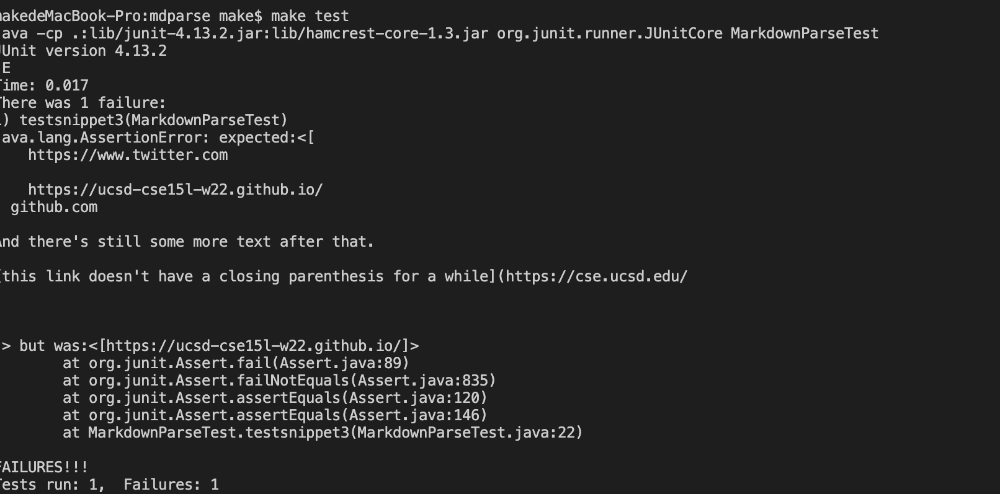

# Week 8 Lab Report
## Links to the repository
own repository: [link](https://github.com/MarkMa2003/markdown-parse)

reviewed repository: [link](https://github.com/RyanRongY/markdown-parse)

## Snippet 1
According to the VSCode preview, the output should be ["`google.com","google.com","ucsd.edu"]

The test code for this snippet in the `MarkdownParse.java` is the following:

```
@Test
    public void testsnippet1() throws IOException{
        Path file = Path.of("s1.md");
        String content=Files.readString(file);
        strList=MarkdownParse.getLinks(content);
        assertEquals(strList, List.of("`google.com","google.com","ucsd.edu"));
    }
```
Test result of my own code: the test failed

Test result of reviewed code: the test failed


Q1:I believe that there is a small code change that can solve this bug. We can compare the index of backticks and brackets. if the backticks come before the brackets, then the link is invalid.

## Snippet 2
According to the VSCode preview, the output should be ["a.com","a.com(())","example.com"]

The test code for this snippet in the `MarkdownParse.java` is the following:

```
@Test
    public void testsnippet2() throws IOException{
        Path file = Path.of("s2.md");
        String content=Files.readString(file);
        strList=MarkdownParse.getLinks(content);
        assertEquals(strList, List.of("a.com","a.com(())","example.com"));
    }
```
Test result of my own code: the test failed

Test result of reviewed code: the test failed


Q2: I think small code change can solve this bug. We can use stack to push and pop parenthesis and brackets and if there are more than one pairs of brackets and parenthesis, take only one into account.

## Snippet 3
According to the VSCode preview, the output should be ["https://ucsd-cse15l-w22.github.io/"]

The test code for this snippet in the `MarkdownParse.java` is the following:

```
@Test
    public void testsnippet3() throws IOException{
        Path file = Path.of("s3.md");
        String content=Files.readString(file);
        strList=MarkdownParse.getLinks(content);
        assertEquals(strList, List.of("https://ucsd-cse15l-w22.github.io/"));
    }
```
Test result of my own code: the test failed

Test result of reviewed code: the test failed


Q3: I think small code change can solve this bug. we can write code to make sure that there are no new blank line inside brackets and parenthesis.